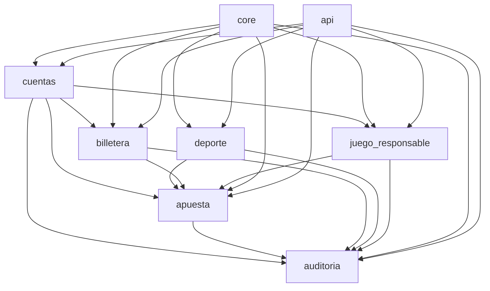

# FairBet Lab — Documentación de aplicaciones Django

## 1. Propósito del documento

Este documento define cómo se organizará el código del proyecto **FairBet Lab** en aplicaciones Django, qué entidades pertenecen a cada aplicación, cuál es su responsabilidad principal, cómo se comunican entre sí y qué criterios se seguirán si el sistema crece.

La finalidad es evitar que el proyecto se convierta en una sola aplicación grande y difícil de mantener. La división propuesta busca que cada app tenga una responsabilidad clara, que las entidades estén agrupadas por dominio y que la lógica crítica del negocio no quede mezclada dentro de archivos `views.py` demasiado grandes.

---

## 2. Criterio de división de aplicaciones

El proyecto se dividirá siguiendo esta regla:

> Una aplicación Django debe representar un módulo funcional del negocio y debe tener una responsabilidad principal.

No se recomienda crear una app por cada tabla, porque eso fragmentaría demasiado el proyecto. Tampoco se recomienda colocar todo en una sola app, porque dificultaría el mantenimiento y el trabajo en equipo.

La estructura propuesta equilibra ambos extremos.

---

## 3. Aplicaciones propuestas

El proyecto se organizará inicialmente en las siguientes aplicaciones:

```text
config/
core/
api/
cuentas/
juego_responsable/
billetera/
deporte/
apuesta/
auditoria/
```

| Aplicación | Tipo | Responsabilidad principal |
|---|---|---|
| `config` | Configuración | Proyecto Django, settings, urls principales, ASGI/WSGI |
| `core` | Soporte | Choices, constantes, excepciones, validadores y utilidades compartidas |
| `api` | Soporte API | Router global, configuración DRF, throttling, paginación, documentación OpenAPI |
| `cuentas` | Negocio | Usuarios, perfiles de jugador y KYC simulado |
| `juego_responsable` | Negocio | Límites de juego responsable y autoexclusiones |
| `billetera` | Negocio crítico | Cuentas, transacciones ledger, LedgerEntry, saldo derivado y movimientos financieros |
| `deporte` | Negocio | Eventos deportivos, mercados, selecciones y odds |
| `apuesta` | Negocio crítico | Apuestas, detalles de apuesta y liquidaciones |
| `auditoria` | Negocio transversal | auditoriaoría inmutable y trazabilidad regulatoria |

---

## 4. Relación general entre aplicaciones



### Lectura del diagrama

- `cuentas` identifica al jugador y determina si existe un perfil válido.
- `juego_responsable` valida si el jugador puede operar según límites y autoexclusión.
- `billetera` administra los fondos virtuales mediante partida doble.
- `deporte` publica eventos, mercados, selecciones y odds.
- `apuesta` coordina la creación y liquidación de apuestas usando `cuentas`, `juego_responsable`, `billetera` y `deporte`.
- `auditoria` registra acciones importantes de todas las apps críticas.
- `core` contiene elementos reutilizables.
- `api` centraliza la exposición de endpoints, documentación y configuraciones generales de API.

---

# 5. Aplicación `cuentas`

## 5.1. Responsabilidad

La app `cuentas` administra la identidad del jugador y su información de KYC simulado. Su propósito es determinar si una persona puede usar la plataforma como jugador válido.

Esta app responde preguntas como:

- ¿Quién es el usuario?
- ¿Tiene perfil de jugador?
- ¿Es mayor de edad?
- ¿Tiene DNI válido?
- ¿Su cuenta está verificada, bloqueada o autoexcluida?

## 5.2. Entidades asignadas

| Entidad / Tabla | Descripción |
|---|---|
| `usuarios` | Representa al usuario del sistema. Puede ser jugador, operador o administrador. |
| `perfiles_jugador` | Extiende al usuario con datos KYC: nombres, apellidos, DNI, fecha de nacimiento y estado de cuenta. |

## 5.3. Cómo aborda el problema

El reto requiere que solo usuarios válidos puedan apostar. Para ello, `cuentas` concentra la validación inicial del jugador.

La plataforma no debe permitir apuestas a usuarios:

- menores de edad;
- sin KYC verificado;
- bloqueados;
- autoexcluidos;
- inactivos.

## 5.4. Funcionamiento principal

Flujo esperado:

```text
1. Usuario se registra.
2. Se crea perfil de jugador en estado pendiente_verificacion.
3. El sistema valida DNI y mayoría de edad.
4. Si pasa validaciones, el perfil cambia a verificado.
5. Solo usuarios verificados pueden apostar.
```

## 5.5. Archivos recomendados

```text
cuentas/
├── models.py
├── admin.py
├── urls.py
├── serializers/
│   ├── __init__.py
│   ├── usuario_serializers.py
│   └── perfil_serializers.py
├── views/
│   ├── __init__.py
│   ├── registro_views.py
│   └── perfil_views.py
├── services/
│   ├── __init__.py
│   └── kyc_service.py
├── validators.py
├── selectors.py
└── tests/
    ├── test_kyc.py
    └── test_perfil_jugador.py
```

## 5.6. Qué no debe hacer esta app

`cuentas` no debe manejar:

- saldo del usuario;
- creación de apuestas;
- cálculo de payout;
- liquidaciones;
- cambios de odds.

Esos comportamientos pertenecen a otras apps.

## 5.7. Si el sistema crece

Si crece, se puede agregar:

- autenticación con JWT personalizado;
- perfiles de operador;
- historial de cambios KYC;
- verificación documental simulada;
- control de sesiones;
- 2FA para operaciones sensibles.

---

# 6. Aplicación `juego_responsable`

## 6.1. Responsabilidad

La app `juego_responsable` administra los controles de juego responsable. Su función es evitar que el usuario pueda realizar operaciones cuando ha superado sus límites o cuando se encuentra autoexcluido.

Esta app responde preguntas como:

- ¿El jugador tiene autoexclusión activa?
- ¿Puede recargar fichas hoy?
- ¿Ha superado su límite diario, semanal o mensual?
- ¿Puede aumentar su límite inmediatamente o debe esperar cooldown?

## 6.2. Entidades asignadas

| Entidad / Tabla | Descripción |
|---|---|
| `limites_juego_responsable` | Define límites de recarga diaria, semanal y mensual por usuario. |
| `autoexclusiones` | Registra autoexclusiones temporales o indefinidas. |

## 6.3. Cómo aborda el problema

El reto exige que los controles de juego responsable sean requisitos funcionales obligatorios. Esto significa que no deben ser solo mensajes visuales; deben bloquear operaciones cuando corresponda.

La app evita que un usuario:

- recargue por encima de sus límites;
- apueste estando autoexcluido;
- revierta una autoexclusión antes de tiempo;
- suba sus límites sin esperar el cooldown de 24 horas.

## 6.4. Funcionamiento principal

Flujo para límites:

```text
1. El usuario configura límite diario, semanal y mensual.
2. Si baja el límite, el cambio se aplica inmediatamente.
3. Si sube el límite, se guarda como pendiente.
4. El nuevo límite se aplica después de 24 horas.
5. Antes de una recarga, se valida el consumo acumulado contra el límite vigente.
```

Flujo para autoexclusión:

```text
1. El usuario solicita autoexclusión temporal o indefinida.
2. Se registra una autoexclusión activa.
3. Mientras esté activa, se bloquean apuestas y recargas.
4. Si es temporal, solo finaliza cuando pasa la fecha configurada.
5. Si es indefinida, requiere intervención administrativa o política definida.
```

## 6.5. Archivos recomendados

```text
juego_responsable/
├── models.py
├── admin.py
├── urls.py
├── serializers/
│   ├── __init__.py
│   ├── limite_serializers.py
│   └── autoexclusion_serializers.py
├── views/
│   ├── __init__.py
│   ├── limite_views.py
│   └── autoexclusion_views.py
├── services/
│   ├── __init__.py
│   ├── limite_service.py
│   └── autoexclusion_service.py
├── selectors.py
└── tests/
    ├── test_limites.py
    └── test_autoexclusion.py
```

## 6.6. Qué no debe hacer esta app

No debe ejecutar movimientos contables. Si una recarga se permite, la operación financiera debe realizarla `billetera`.

Tampoco debe crear apuestas. Solo debe responder si el jugador puede o no puede operar.

## 6.7. Si el sistema crece

Puede crecer hacia:

- reportes de comportamiento de riesgo;
- alertas preventivas;
- límites por tipo de apuesta;
- pausas de actividad;
- historial de cambios de límites;
- integración con módulo antifraude.

---

# 7. Aplicación `billetera`

## 7.1. Responsabilidad

La app `billetera` administra toda la lógica financiera virtual de la plataforma. Es una de las apps más críticas porque el reto exige contabilidad de partida doble, saldo derivado, idempotencia y prevención de doble gasto.

Esta app responde preguntas como:

- ¿Cuál es el saldo disponible del jugador?
- ¿La transacción está balanceada?
- ¿Ya se procesó esta `idempotency_key`?
- ¿Se pueden bloquear fondos para una apuesta?
- ¿Cómo se liquida financieramente una apuesta ganada o perdida?

## 7.2. Entidades asignadas

| Entidad / Tabla | Descripción |
|---|---|
| `cuentas` | Representa cuentas contables: `billetera_usuario`, `casa`, `apuestas_pendientes`, `bonos`. |
| `transacciones_ledger` | Agrupa una operación financiera completa. |
| `ledger_entries` | Registra cada movimiento contable con `amount`, `direction` y `transaction_id`. |
| `v_saldos_cuentas` | Vista de base de datos que calcula el saldo derivado. |

## 7.3. Cómo aborda el problema

La guía indica que el saldo no debe almacenarse directamente. Por eso, `billetera` calcula el saldo desde el ledger:

```text
saldo = SUM(CREDIT) - SUM(DEBIT)
```

Cada operación financiera debe generar como mínimo dos movimientos balanceados.

Ejemplo de apuesta:

```text
billetera_usuario       DEBIT   20
apuestas_pendientes  CREDIT  20
```

Ejemplo de apuesta perdida:

```text
apuestas_pendientes  DEBIT   20
casa                 CREDIT  20
```

Ejemplo de apuesta ganada:

```text
apuestas_pendientes  DEBIT   20
casa                 DEBIT   30
billetera_usuario       CREDIT  50
```

## 7.4. Funcionamiento principal

Operaciones principales:

```text
recargar_fichas(usuario, monto, idempotency_key)
retirar_fichas(usuario, monto, idempotency_key)
bloquear_stake(usuario, apuesta, monto, idempotency_key)
liquidar_apuesta_ganada(apuesta, payout)
liquidar_apuesta_perdida(apuesta)
calcular_saldo(cuenta)
validar_transaccion_balanceada(transaction_id)
```

## 7.5. Archivos recomendados

```text
billetera/
├── models.py
├── admin.py
├── urls.py
├── serializers/
│   ├── __init__.py
│   ├── cuenta_serializers.py
│   └── ledger_serializers.py
├── views/
│   ├── __init__.py
│   ├── cuenta_views.py
│   └── movimiento_views.py
├── services/
│   ├── __init__.py
│   ├── ledger_service.py
│   └── billetera_service.py
├── selectors.py
├── exceptions.py
└── tests/
    ├── test_ledger_balanceado.py
    ├── test_saldos.py
    ├── test_idempotencia.py
    └── test_concurrencia.py
```

## 7.6. Qué no debe hacer esta app

`billetera` no debe decidir si una selección ganó o perdió. Eso pertenece a `deporte` y `apuesta`.

Tampoco debe validar KYC ni autoexclusión. Esas reglas vienen de `cuentas` y `juego_responsable`.

`billetera` solo debe ejecutar operaciones financieras seguras.

## 7.7. Si el sistema crece

Puede crecer hacia:

- cuentas por moneda virtual;
- bonos separados del saldo principal;
- reversión de transacciones;
- conciliación financiera;
- reportes de GGR;
- exportación contable;
- tareas asíncronas con Celery para reportes o reconciliación.

Si crece demasiado, se puede dividir internamente sin crear otra app:

```text
billetera/services/ledger_service.py
billetera/services/balance_service.py
billetera/services/settlement_service.py
billetera/services/idempotency_service.py
```

---

# 8. Aplicación `deporte`

## 8.1. Responsabilidad

La app `deporte` administra el catálogo deportivo: eventos, mercados, selecciones y odds. Su propósito es definir sobre qué puede apostar el usuario.

Esta app responde preguntas como:

- ¿Qué eventos están programados?
- ¿Qué mercados tiene un evento?
- ¿Qué selecciones existen en un mercado?
- ¿Cuál es la odds vigente?
- ¿El mercado está abierto, suspendido o cerrado?
- ¿La odds cambió desde que el usuario abrió el ticket?

## 8.2. Entidades asignadas

| Entidad / Tabla | Descripción |
|---|---|
| `eventos_deportivos` | Partido o evento deportivo disponible. |
| `mercados` | Tipo de apuesta dentro del evento, por ejemplo `1X2`. |
| `selecciones_mercado` | Opciones apostables dentro del mercado, como gana local, empate o gana visitante. |
| `historial_odds` | Historial de cuotas por selección. Permite re-cotización y trazabilidad. |

## 8.3. Cómo aborda el problema

El usuario no apuesta directamente a un evento. Apuesta a una selección dentro de un mercado.

Ejemplo:

```text
Evento: Perú vs Brasil
Mercado: 1X2
Selecciones:
- HOME_WIN: gana Perú
- DRAW: empate
- AWAY_WIN: gana Brasil
```

La app también permite saber si una cuota cambió. Esto es importante porque si el usuario abrió un ticket con una odds y antes de confirmar la odds cambió, el sistema debe pedir reconfirmación.

## 8.4. Funcionamiento principal

Operaciones principales:

```text
crear_evento()
abrir_mercado()
suspender_mercado()
cerrar_mercado()
actualizar_odds()
obtener_odds_vigente()
confirmar_resultado_evento()
marcar_seleccion_ganadora()
```

## 8.5. Archivos recomendados

```text
deporte/
├── models.py
├── admin.py
├── urls.py
├── serializers/
│   ├── __init__.py
│   ├── evento_serializers.py
│   ├── mercado_serializers.py
│   ├── seleccion_serializers.py
│   └── odds_serializers.py
├── views/
│   ├── __init__.py
│   ├── evento_views.py
│   ├── mercado_views.py
│   └── odds_views.py
├── services/
│   ├── __init__.py
│   ├── evento_service.py
│   ├── mercado_service.py
│   └── odds_service.py
├── selectors.py
└── tests/
    ├── test_eventos.py
    ├── test_mercados.py
    └── test_odds.py
```

## 8.6. Qué no debe hacer esta app

`deporte` no debe crear apuestas ni bloquear fondos. Solo administra la información deportiva y los resultados.

Tampoco debe calcular payout financiero; esa responsabilidad pertenece a `apuesta` y `billetera`.

## 8.7. Si el sistema crece

Puede crecer hacia:

- `competitions` y `teams` como entidades separadas;
- estadísticas deportivas;
- mercados adicionales;
- canales de Django Channels por evento;
- feed de odds en tiempo real;
- suspensión automática de mercados por eventos críticos;
- integración con datos externos simulados.

Si `deporte` crece demasiado, podría dividirse más adelante en:

```text
deporte/        eventos, equipos, competiciones
markets/       mercados, selecciones, odds
live/          canales en vivo y suspensión automática
```

Por ahora no se recomienda separar desde el inicio para evitar sobrearquitectura.

---

# 9. Aplicación `apuesta`

## 9.1. Responsabilidad

La app `apuesta` administra el ciclo de vida de las apuestas. Es la app que coordina validaciones de usuario, juego responsable, mercado, odds y billetera.

Esta app responde preguntas como:

- ¿El usuario puede crear esta apuesta?
- ¿El stake está dentro de límites permitidos?
- ¿La selección sigue activa?
- ¿La odds sigue vigente?
- ¿Cuánto es el payout potencial?
- ¿La apuesta ganó, perdió o fue anulada?

## 9.2. Entidades asignadas

| Entidad / Tabla | Descripción |
|---|---|
| `apuestas` | Representa la apuesta principal. |
| `detalles_apuesta` | Representa las selecciones apostadas. Para simple hay un detalle; para combinada hay varios. |
| `liquidaciones_apuesta` | Guarda el resultado económico de la apuesta. |

## 9.3. Cómo aborda el problema

La app `apuesta` une varias partes del sistema:

```text
cuentas            → valida usuario verificado
juego_responsable  → valida límites y autoexclusión
deporte              → valida evento, mercado, selección y odds
billetera              → bloquea stake y liquida fondos
```

Una apuesta no debe crearse directamente con un simple `save()`. Debe pasar por un servicio que ejecute todas las validaciones y operaciones financieras dentro de una transacción atómica.

## 9.4. Funcionamiento principal

Flujo de creación de apuesta:

```text
1. Usuario selecciona evento, mercado, selección y stake.
2. apuesta valida que el usuario esté habilitado.
3. apuesta valida que no exista autoexclusión activa.
4. apuesta valida que el mercado esté abierto.
5. apuesta valida que la odds sea vigente.
6. apuesta solicita a billetera bloquear el stake.
7. billetera mueve fondos de billetera_usuario a apuestas_pendientes.
8. apuesta crea la apuesta en estado accepted.
9. auditoria registra la operación.
```

Flujo de liquidación:

```text
1. Admin o sistema confirma resultado del evento.
2. deporte marca selección ganadora/perdedora.
3. apuesta identifica apuestas afectadas.
4. apuesta calcula resultado de cada apuesta.
5. Si ganó, calcula payout = stake × odds.
6. billetera ejecuta liquidación financiera.
7. apuesta crea liquidación_apuesta.
8. auditoria registra la liquidación.
```

## 9.5. Máquina de estados inicial

```text
draft → accepted
accepted → won
accepted → lost
accepted → void
accepted → cashed_out
accepted → cancelled
```

Reglas:

- `draft` no debe mover dinero.
- `accepted` significa que el stake ya fue bloqueado.
- `won` debe tener liquidación con payout.
- `lost` debe liberar el stake hacia la casa.
- `void` debe devolver el stake al usuario.
- `cashed_out` se usará si se implementa cash-out.

## 9.6. Archivos recomendados

```text
apuesta/
├── models.py
├── admin.py
├── urls.py
├── serializers/
│   ├── __init__.py
│   ├── apuesta_serializers.py
│   └── liquidacion_serializers.py
├── views/
│   ├── __init__.py
│   ├── apuesta_views.py
│   └── liquidacion_views.py
├── services/
│   ├── __init__.py
│   ├── apuesta_service.py
│   └── liquidacion_service.py
├── state_machine.py
├── selectors.py
├── exceptions.py
└── tests/
    ├── test_crear_apuesta.py
    ├── test_liquidar_apuesta.py
    ├── test_maquina_estados.py
    └── test_apuestas_combinadas.py
```

## 9.7. Qué no debe hacer esta app

No debe manipular directamente `ledger_entries` sin pasar por `billetera`.

No debe actualizar odds directamente; eso pertenece a `deporte`.

No debe modificar reglas KYC; eso pertenece a `cuentas`.

## 9.8. Si el sistema crece

Puede crecer hacia:

- apuestas combinadas;
- cash-out;
- apuestas in-play;
- validación de selecciones incompatibles;
- re-cotización obligatoria;
- colas Celery para liquidaciones masivas;
- modelos de riesgo y exposure.

Si crece mucho, se puede dividir internamente:

```text
apuesta/services/apuesta_service.py
apuesta/services/liquidacion_service.py
apuesta/services/combinada_service.py
apuesta/services/cash_out_service.py
apuesta/services/in_play_service.py
```

Si aun así crece demasiado, se podrían crear apps futuras:

```text
cashout/
risk/
promotions/
reports/
```

---

# 10. Aplicación `auditoria`

## 10.1. Responsabilidad

La app `auditoria` administra la auditoriaoría inmutable. Su objetivo es registrar acciones críticas de manera trazable y verificable.

Esta app responde preguntas como:

- ¿Quién creó una apuesta?
- ¿Quién cambió una odds?
- ¿Qué movimiento de billetera se generó?
- ¿Quién liquidó una apuesta?
- ¿La cadena de auditoriaoría fue alterada?

## 10.2. Entidades asignadas

| Entidad / Tabla | Descripción |
|---|---|
| `auditoriaoria_inmutable` | Registro append-only con hash anterior, payload y hash actual. |

## 10.3. Cómo aborda el problema

La plataforma maneja operaciones sensibles: movimientos de billetera, apuestas, cambios de odds y liquidaciones. Por ello, cada acción crítica debe quedar registrada.

El enfoque append-only significa:

```text
No se actualiza.
No se elimina.
Solo se inserta.
```

Cada registro contiene:

```text
hash_anterior + payload_json → hash_actual
```

Si alguien modifica un registro antiguo, la cadena deja de coincidir.

## 10.4. Funcionamiento principal

Operaciones principales:

```text
registrar_evento_auditoriaoria(actor, accion, entidad, payload)
calcular_hash(payload, hash_anterior)
verificar_integridad_cadena()
obtener_historial_entidad(tipo_entidad, id_entidad)
```

## 10.5. Archivos recomendados

```text
auditoria/
├── models.py
├── admin.py
├── urls.py
├── serializers.py
├── views.py
├── services.py
├── selectors.py
└── tests/
    ├── test_auditoriaoria_hash.py
    └── test_integridad_cadena.py
```

## 10.6. Qué no debe hacer esta app

No debe ejecutar reglas de negocio de apuestas, billetera o deportes.

Solo registra evidencia de lo que ya ocurrió.

## 10.7. Si el sistema crece

Puede crecer hacia:

- endpoint administrativo de verificación de cadena;
- filtros por entidad;
- exportación de auditoriaoría;
- firma digital simulada;
- eventos de auditoriaoría asincrónicos con Celery;
- separación entre auditoriaoría técnica y auditoriaoría regulatoria.

---

# 11. Aplicación `core`

## 11.1. Responsabilidad

La app `core` contiene elementos comunes que serán usados por varias aplicaciones.

No debe representar un módulo de negocio específico. Su objetivo es evitar duplicación de código.

## 11.2. Contenido recomendado

```text
core/
├── choices.py
├── constants.py
├── exceptions.py
├── validators.py
├── decimal.py
├── dates.py
└── utils.py
```

## 11.3. Ejemplos de contenido

`choices.py` puede contener:

```text
EstadoCuenta
TipoCuenta
DirectionLedger
EstadoEvento
EstadoMercado
EstadoApuesta
TipoAutoexclusion
PeriodoLimite
```

`decimal.py` puede contener utilidades para:

```text
cuantizar montos
validar precisión decimal
evitar float
redondear según política interna
```

`exceptions.py` puede contener excepciones de dominio:

```text
SaldoInsuficienteError
UsuarioNoVerificadoError
MercadoCerradoError
OddsDesactualizadaError
AutoexclusionActivaError
TransaccionDuplicadaError
```

## 11.4. Qué no debe hacer esta app

`core` no debe tener modelos de negocio importantes. Tampoco debe convertirse en un basurero de funciones sin relación.

Si una función pertenece claramente a billetera, debe ir en `billetera`. Si pertenece a apuesta, debe ir en `apuesta`.

---

# 12. Aplicación `api`

## 12.1. Responsabilidad

La app `api` centraliza elementos generales de la API REST.

No debe contener toda la lógica ni todos los serializers del proyecto. Cada app debe mantener sus propios serializers, views y servicios.

## 12.2. Contenido recomendado

```text
api/
├── urls.py
├── pagination.py
├── permissions.py
├── throttles.py
├── responses.py
├── exceptions.py
└── schema.py
```

## 12.3. Funciones principales

- Registrar routers de las apps.
- Definir configuración base de paginación.
- Definir throttles globales.
- Definir permisos reutilizables.
- Configurar documentación OpenAPI.
- Centralizar respuestas estándar.

## 12.4. Qué no debe hacer esta app

No debe contener lógica de billetera, apuestas, deportes o KYC.

Tampoco debe convertirse en una app gigante con todos los `ViewSet`. Cada app debe tener sus propias vistas.

---

# 13. Organización interna para evitar archivos enormes

Cuando una app tenga varias entidades o muchas vistas, se recomienda reemplazar archivos únicos por carpetas.

En lugar de:

```text
deporte/views.py
deporte/serializers.py
```

Usar:

```text
deporte/views/
├── __init__.py
├── evento_views.py
├── mercado_views.py
└── odds_views.py

deporte/serializers/
├── __init__.py
├── evento_serializers.py
├── mercado_serializers.py
└── odds_serializers.py
```

Regla práctica:

```text
Si una app supera 2 o 3 vistas relevantes, convertir views.py en carpeta views/.
Si una app supera 2 o 3 serializers relevantes, convertir serializers.py en carpeta serializers/.
Si una app contiene lógica crítica, crear carpeta services/.
```

## 13.1. Patrón recomendado por app compleja

```text
app/
├── models.py
├── admin.py
├── urls.py
├── serializers/
├── views/
├── services/
├── selectors.py
├── validators.py
├── exceptions.py
└── tests/
```

## 13.2. Responsabilidad de cada tipo de archivo

| Archivo / Carpeta | Responsabilidad |
|---|---|
| `models.py` | Estructura de datos y reglas básicas del modelo |
| `serializers/` | Entrada y salida de datos para API |
| `views/` | Endpoints, recepción de request y respuesta HTTP |
| `services/` | Lógica de negocio y casos de uso |
| `selectors.py` | Consultas reutilizables y optimizadas |
| `validators.py` | Validaciones reutilizables |
| `exceptions.py` | Errores de dominio |
| `tests/` | Pruebas unitarias, integración y concurrencia |

---

# 14. Reglas para dependencias entre apps

## 14.1. Dependencias permitidas

```text
apuesta puede usar cuentas, juego_responsable, deporte y billetera.
billetera puede usar cuentas.
deporte puede usar cuentas solo para registrar quién cambió odds.
auditoria puede recibir eventos desde todas las apps.
api puede importar rutas de todas las apps.
core puede ser usado por todas las apps.
```

## 14.2. Dependencias que se deben evitar

```text
billetera no debe depender de apuesta.
deporte no debe depender de apuesta.
cuentas no debe depender de apuesta.
auditoria no debe modificar lógica de otras apps.
core no debe importar modelos de apps de negocio.
```

Esto ayuda a evitar dependencias circulares.

---

# 15. Flujo principal entre aplicaciones

## 15.1. Crear apuesta

```text
1. API recibe request.
2. apuesta.views.CrearApuestaView valida serializer.
3. apuesta.services.apuesta_service valida usuario con cuentas.
4. apuesta.services.apuesta_service consulta juego_responsable.
5. apuesta.services.apuesta_service valida mercado y odds en deporte.
6. apuesta.services.apuesta_service solicita bloqueo de fondos a billetera.
7. billetera crea transacciones_ledger y ledger_entries.
8. apuesta crea apuesta y detalle_apuesta.
9. auditoria registra creación de apuesta y movimiento financiero.
```

## 15.2. Liquidar apuesta

```text
1. Admin confirma resultado en deporte.
2. deporte marca selección ganadora/perdedora.
3. apuesta identifica apuestas pendientes afectadas.
4. apuesta calcula resultado y payout.
5. billetera ejecuta liquidación financiera.
6. apuesta crea liquidaciones_apuesta.
7. auditoria registra liquidación.
```

## 15.3. Recargar fichas virtuales

```text
1. API recibe solicitud de recarga.
2. juego_responsable valida límites.
3. cuentas valida usuario activo/verificado.
4. billetera crea transacción balanceada.
5. auditoria registra movimiento.
```

---

# 16. Estrategia si el proyecto crece

La arquitectura debe permitir crecer sin reescribir todo.

## 16.1. Crecimiento de `deporte`

Si se agregan equipos, competiciones reales o estadísticas, se puede separar:

```text
deporte/       eventos, equipos, competiciones
markets/      mercados, selecciones, odds
live/         Channels y eventos en vivo
```

## 16.2. Crecimiento de `apuesta`

Si se agregan muchas funciones avanzadas, se puede separar internamente:

```text
apuesta/services/simple_bet_service.py
apuesta/services/combo_bet_service.py
apuesta/services/cash_out_service.py
apuesta/services/in_play_service.py
apuesta/services/settlement_service.py
```

Si el crecimiento es mayor, se podrían crear apps nuevas:

```text
cashout/
risk/
promotions/
reports/
```

## 16.3. Crecimiento de `billetera`

Si el billetera se vuelve más complejo, se puede separar por servicios:

```text
billetera/services/ledger_service.py
billetera/services/balance_service.py
billetera/services/funds_service.py
billetera/services/idempotency_service.py
billetera/services/reversal_service.py
```

## 16.4. Crecimiento de `auditoria`

Si la auditoriaoría crece, se puede separar:

```text
auditoria/services/hash_chain_service.py
auditoria/services/auditoria_log_service.py
auditoria/services/integrity_check_service.py
```

---

# 17. Recomendación para trabajo en equipo

Esta división también ayuda a asignar responsabilidades:

| Integrante | App sugerida | Motivo |
|---|---|---|
| Líder técnico | `core`, `api`, integración general | Define base común, rutas y convenciones |
| Integrante 1 | `cuentas` + `juego_responsable` | Usuario, KYC y controles obligatorios |
| Integrante 2 | `billetera` | Módulo crítico de partida doble |
| Integrante 3 | `deporte` | Eventos, mercados y odds |
| Integrante 4 | `apuesta` | Apuestas, liquidación y máquina de estados |
| Todos | `auditoria` y tests | Cada módulo debe registrar acciones críticas |

---

# 18. Reglas de mantenimiento

1. No poner lógica crítica en `views.py`.
2. Toda operación financiera debe pasar por `billetera.services`.
3. Toda creación de apuesta debe pasar por `apuesta.services`.
4. Todo cambio importante debe registrarse en `auditoria`.
5. No guardar saldo directamente en el usuario ni en la cuenta.
6. Usar `Decimal`, nunca `float`, para montos, odds, stake y payout.
7. Evitar dependencias circulares.
8. Mantener tests especialmente en `billetera` y `apuesta`.
9. Usar Conventional Commits.
10. Documentar decisiones importantes en ADRs.

---

# 19. Estructura final recomendada del proyecto

```text
fairbet/
├── manage.py
├── requirements.txt
├── docker-compose.yml
├── Dockerfile
├── .env.example
├── config/
│   ├── settings.py
│   ├── urls.py
│   ├── asgi.py
│   └── wsgi.py
├── core/
│   ├── choices.py
│   ├── constants.py
│   ├── exceptions.py
│   ├── validators.py
│   └── utils.py
├── api/
│   ├── urls.py
│   ├── pagination.py
│   ├── permissions.py
│   ├── throttles.py
│   └── responses.py
├── cuentas/
├── juego_responsable/
├── billetera/
├── deporte/
├── apuesta/
├── auditoria/
└── docs/
    ├── arquitectura-aplicaciones.md
    ├── entidades.md
    ├── adr/
    ├── sketches/
    ├── lecciones.md
    └── anti-ai-disclosure.md
```

---

# 20. Conclusión

La división recomendada para FairBet es:

```text
cuentas
juego_responsable
billetera
deporte
apuesta
auditoria
core
api
```

Esta estructura mantiene separadas las responsabilidades más importantes del sistema:

- identidad y KYC;
- juego responsable;
- contabilidad y billetera;
- catálogo deportivo;
- apuestas y liquidaciones;
- auditoriaoría y trazabilidad;
- soporte común;
- exposición de API.

Con esta arquitectura, el proyecto puede iniciar simple, pero crecer de manera ordenada hacia funciones avanzadas como cuotas en tiempo real, apuestas combinadas, cash-out, antifraude, bonos y reportes del operador.
