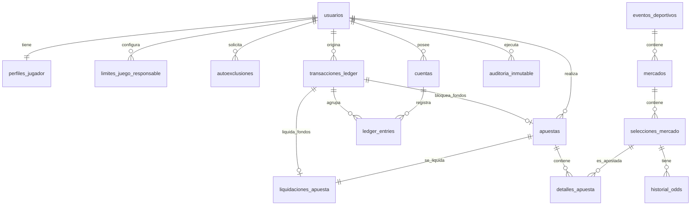

# FairBet Lab — Documentación de Entidades de Base de Datos

**Versión:** 1.0  
**Alcance:** Modelo reducido para el núcleo obligatorio del reto  
**Objetivo del documento:** Describir cada entidad de la base de datos, su propósito, los problemas que resuelve, sus atributos principales y sus relaciones dentro de la plataforma.

---

## 1. Contexto del modelo

FairBet Lab es una plataforma educativa de apuestas deportivas con moneda virtual. El sistema no representa una casa de apuestas real, no usa pasarelas de pago y no convierte fichas en dinero real.

El modelo de base de datos se diseñó alrededor de los siguientes problemas principales:

1. **Registro y verificación del jugador:** controlar que el usuario cumpla KYC simulado, sea mayor de edad y tenga una cuenta válida.
2. **Integridad financiera:** registrar cada movimiento de fichas mediante partida doble, evitando saldos inconsistentes.
3. **Prevención de doble gasto:** controlar operaciones financieras con `idempotency_key`, transacciones y bloqueo de fondos.
4. **Gestión deportiva:** administrar eventos, mercados, selecciones y cuotas.
5. **Ciclo de vida de apuestas:** crear, aceptar, bloquear fondos, resolver y liquidar apuestas.
6. **Juego responsable:** aplicar límites y autoexclusión como controles bloqueantes.
7. **Auditoría:** registrar acciones críticas de forma trazable e inmutable.

---

## 2. Resumen de entidades

| Módulo | Entidad / Tabla | Propósito principal |
|---|---|---|
| Usuarios y KYC | `usuarios` | Gestionar credenciales, roles y estado de acceso. |
| Usuarios y KYC | `perfiles_jugador` | Guardar información KYC simulada del jugador. |
| Juego responsable | `limites_juego_responsable` | Controlar límites de depósito virtual por periodo. |
| Juego responsable | `autoexclusiones` | Bloquear al jugador por decisión propia. |
| Wallet | `cuentas` | Representar cuentas contables del usuario y del sistema. |
| Wallet | `transacciones_ledger` | Agrupar una operación financiera completa. |
| Wallet | `ledger_entries` | Registrar débitos y créditos de cada transacción. |
| Wallet | `v_saldos_cuentas` | Calcular saldos derivados desde el ledger. |
| Eventos | `eventos_deportivos` | Representar partidos o eventos disponibles. |
| Mercados | `mercados` | Representar tipos de apuestas sobre un evento. |
| Mercados | `selecciones_mercado` | Representar opciones apostables dentro de un mercado. |
| Odds | `historial_odds` | Registrar cuotas vigentes e históricas. |
| Apuestas | `apuestas` | Representar la apuesta principal del usuario. |
| Apuestas | `detalles_apuesta` | Registrar las selecciones incluidas en una apuesta. |
| Apuestas | `liquidaciones_apuesta` | Registrar el resultado financiero final de una apuesta. |
| Auditoría | `auditoria_inmutable` | Registrar eventos críticos con hash de integridad. |

---

## 3. Diagrama general de relaciones



---

# 4. Documentación de entidades

---

## 4.1. `usuarios`

### ¿Para qué sirve?

La tabla `usuarios` representa la identidad principal del sistema. Permite autenticar usuarios, diferenciar roles y controlar si una cuenta puede acceder o no a la plataforma.

### Problema que aborda

La plataforma necesita distinguir entre jugadores, administradores y operadores. Además, debe poder bloquear el acceso general a una cuenta sin eliminarla, manteniendo la trazabilidad de sus apuestas y movimientos financieros.

### Cómo impacta en la plataforma

Un usuario puede:

- Tener un perfil KYC.
- Tener una o más cuentas contables.
- Realizar apuestas.
- Generar transacciones financieras.
- Ser actor de eventos registrados en auditoría.
- Actuar como administrador u operador si su rol lo permite.

### Atributos

| Campo | Tipo lógico | Descripción |
|---|---|---|
| `id_usuario` | Identificador | Clave primaria del usuario. |
| `nombre_usuario` | Texto único | Nombre de usuario para login o identificación. |
| `correo` | Email único | Correo electrónico del usuario. |
| `password_hash` | Texto | Contraseña en formato hash. No debe guardarse en texto plano. |
| `rol` | Enumerado | Rol del usuario: `PLAYER`, `ADMIN`, `OPERATOR`. |
| `activo` | Booleano | Indica si el usuario puede acceder al sistema. |
| `created_at` | Fecha/hora | Fecha de creación. |
| `updated_at` | Fecha/hora | Fecha de última actualización. |

### Reglas de negocio

- Un usuario con `activo = 0` no debe poder iniciar sesión ni operar en la plataforma.
- Un usuario con rol `PLAYER` representa a un jugador.
- Un usuario con rol `ADMIN` u `OPERATOR` puede gestionar eventos, cuotas, liquidaciones o auditoría según los permisos definidos en la aplicación.

### Relaciones

| Relación | Descripción |
|---|---|
| `usuarios` 1:1 `perfiles_jugador` | Cada jugador tiene un perfil KYC. |
| `usuarios` 1:N `cuentas` | Un usuario puede tener cuentas contables. |
| `usuarios` 1:N `apuestas` | Un usuario puede realizar muchas apuestas. |
| `usuarios` 1:N `transacciones_ledger` | Un usuario puede originar muchas operaciones financieras. |
| `usuarios` 1:N `auditoria_inmutable` | Un usuario puede ser actor de muchas acciones auditadas. |

---

## 4.2. `perfiles_jugador`

### ¿Para qué sirve?

La tabla `perfiles_jugador` almacena los datos personales necesarios para el KYC simulado. Sirve para validar identidad, edad y estado de cuenta del jugador.

### Problema que aborda

La plataforma debe impedir que usuarios no verificados, menores de edad, bloqueados o autoexcluidos puedan apostar. Esta entidad centraliza esa información.

### Cómo impacta en la plataforma

Antes de aceptar una apuesta o una recarga simulada, el sistema debe validar el estado del perfil. El perfil determina si el usuario puede operar como jugador.

### Atributos

| Campo | Tipo lógico | Descripción |
|---|---|---|
| `id_perfil` | Identificador | Clave primaria del perfil. |
| `id_usuario` | FK | Usuario asociado. Relación uno a uno. |
| `nombres` | Texto | Nombres del jugador. |
| `apellidos` | Texto | Apellidos del jugador. |
| `dni` | Texto único | DNI peruano de 8 dígitos. |
| `fecha_nacimiento` | Fecha | Permite validar mayoría de edad. |
| `telefono` | Texto | Teléfono opcional. |
| `estado_cuenta` | Enumerado | Estado operativo del jugador. |
| `kyc_verificado_en` | Fecha/hora | Fecha en la que fue verificado. |
| `created_at` | Fecha/hora | Fecha de creación. |
| `updated_at` | Fecha/hora | Fecha de última actualización. |

### Estados de cuenta

| Estado | Significado |
|---|---|
| `pendiente_verificacion` | El jugador se registró, pero aún no fue verificado. |
| `verificado` | El jugador puede operar si no tiene bloqueos adicionales. |
| `bloqueado` | La cuenta está bloqueada por decisión administrativa o regla del sistema. |
| `autoexcluido` | El jugador se encuentra autoexcluido. |

### Reglas de negocio

- El DNI debe ser único.
- El DNI debe tener 8 dígitos numéricos.
- La fecha de nacimiento debe indicar que el jugador tiene al menos 18 años.
- Solo jugadores con `estado_cuenta = 'verificado'` pueden apostar.
- Si el jugador está `bloqueado` o `autoexcluido`, no debe poder apostar ni recargar fichas virtuales.

### Relaciones

| Relación | Descripción |
|---|---|
| `perfiles_jugador` N:1 `usuarios` | Cada perfil pertenece a un usuario. |

---

## 4.3. `limites_juego_responsable`

### ¿Para qué sirve?

La tabla `limites_juego_responsable` almacena los límites de depósito virtual configurados por el usuario para periodos diarios, semanales y mensuales.

### Problema que aborda

La plataforma debe incorporar controles de juego responsable. Un usuario no debería poder recargar fichas virtuales ilimitadamente si estableció límites personales.

### Cómo impacta en la plataforma

Antes de una recarga simulada, el sistema debe calcular cuánto ha recargado el usuario en el periodo correspondiente y compararlo con el límite vigente.

### Atributos

| Campo | Tipo lógico | Descripción |
|---|---|---|
| `id_limite` | Identificador | Clave primaria del límite. |
| `id_usuario` | FK | Usuario dueño del límite. |
| `periodo` | Enumerado | Periodo del límite: `diario`, `semanal`, `mensual`. |
| `limite_actual` | Decimal | Límite actualmente vigente. |
| `limite_pendiente` | Decimal | Nuevo límite solicitado, pendiente de aplicar. |
| `pendiente_aplicar_en` | Fecha/hora | Momento en el que se aplicará el nuevo límite. |
| `created_at` | Fecha/hora | Fecha de creación. |
| `updated_at` | Fecha/hora | Fecha de última actualización. |

### Reglas de negocio

- Un usuario debe tener máximo un límite por periodo.
- El límite actual no puede ser negativo.
- Reducir un límite debe aplicarse inmediatamente.
- Aumentar un límite debe quedar pendiente y aplicarse después del tiempo de espera definido.
- Una recarga simulada debe ser rechazada si supera el límite diario, semanal o mensual.

### Relaciones

| Relación | Descripción |
|---|---|
| `limites_juego_responsable` N:1 `usuarios` | Cada límite pertenece a un usuario. |

---

## 4.4. `autoexclusiones`

### ¿Para qué sirve?

La tabla `autoexclusiones` registra periodos en los que un jugador decide excluirse voluntariamente de la plataforma.

### Problema que aborda

Un sistema con apuestas, incluso virtuales, debe permitir que el jugador se bloquee temporal o indefinidamente como medida de juego responsable.

### Cómo impacta en la plataforma

Si existe una autoexclusión activa, el usuario no debe poder apostar, recargar fichas, aceptar cash-out ni realizar acciones relacionadas con juego.

### Atributos

| Campo | Tipo lógico | Descripción |
|---|---|---|
| `id_autoexclusion` | Identificador | Clave primaria. |
| `id_usuario` | FK | Usuario autoexcluido. |
| `tipo_autoexclusion` | Enumerado | `temporal` o `indefinida`. |
| `inicia_en` | Fecha/hora | Inicio de la autoexclusión. |
| `finaliza_en` | Fecha/hora | Fin de la autoexclusión, si es temporal. |
| `activa` | Booleano | Indica si la autoexclusión sigue vigente. |
| `motivo` | Texto | Motivo opcional. |
| `created_at` | Fecha/hora | Fecha de registro. |

### Reglas de negocio

- Un usuario no debe tener más de una autoexclusión activa al mismo tiempo.
- Una autoexclusión temporal no debe poder revertirse antes de la fecha de fin.
- Una autoexclusión indefinida debe permanecer activa hasta que exista un proceso administrativo de revisión.
- El perfil del jugador puede reflejar `estado_cuenta = 'autoexcluido'` mientras exista una autoexclusión activa.

### Relaciones

| Relación | Descripción |
|---|---|
| `autoexclusiones` N:1 `usuarios` | Un usuario puede tener historial de autoexclusiones. |

---

# 5. Módulo wallet y contabilidad

---

## 5.1. `cuentas`

### ¿Para qué sirve?

La tabla `cuentas` representa las cuentas contables del sistema. Estas cuentas no almacenan saldo directamente; solo sirven como contenedores de movimientos registrados en `ledger_entries`.

### Problema que aborda

La plataforma necesita separar el dinero virtual disponible del jugador, los fondos bloqueados en apuestas, la cuenta de la casa y posibles bonos. Esta separación permite aplicar partida doble y rastrear cada movimiento.

### Cómo impacta en la plataforma

Todo movimiento financiero afecta una o más cuentas mediante `ledger_entries`. Por ejemplo, cuando el usuario apuesta, se mueve el `stake` desde `wallet_usuario` hacia `apuestas_pendientes`.

### Atributos

| Campo | Tipo lógico | Descripción |
|---|---|---|
| `id_cuenta` | Identificador | Clave primaria. |
| `id_usuario` | FK nullable | Usuario dueño de la cuenta, si aplica. |
| `tipo_cuenta` | Enumerado | Tipo contable de la cuenta. |
| `codigo` | Texto único | Código interno de cuenta. |
| `nombre` | Texto | Nombre descriptivo. |
| `estado` | Enumerado | Estado operativo de la cuenta. |
| `created_at` | Fecha/hora | Fecha de creación. |

### Tipos de cuenta

| Tipo | Descripción |
|---|---|
| `wallet_usuario` | Cuenta individual del jugador para fichas disponibles. |
| `casa` | Cuenta interna que representa a la plataforma. |
| `apuestas_pendientes` | Cuenta interna donde se bloquean fondos de apuestas aceptadas. |
| `bonos` | Cuenta para fichas promocionales o bonos futuros. |

### Estados

| Estado | Significado |
|---|---|
| `activa` | Puede recibir movimientos. |
| `bloqueada` | No debería permitir nuevos movimientos. |
| `cerrada` | Cuenta inactiva o retirada del uso operativo. |

### Reglas de negocio

- No se debe guardar saldo en esta tabla.
- Una cuenta de tipo `wallet_usuario` debe pertenecer a un usuario.
- Las cuentas internas como `casa` y `apuestas_pendientes` pueden tener `id_usuario = NULL`.
- El saldo se calcula desde la vista `v_saldos_cuentas`.

### Relaciones

| Relación | Descripción |
|---|---|
| `cuentas` N:1 `usuarios` | Una cuenta puede pertenecer a un usuario. |
| `cuentas` 1:N `ledger_entries` | Una cuenta puede tener muchos movimientos contables. |

---

## 5.2. `transacciones_ledger`

### ¿Para qué sirve?

La tabla `transacciones_ledger` agrupa una operación financiera completa. Una transacción puede contener dos o más movimientos en `ledger_entries`.

### Problema que aborda

Una operación financiera no se debe registrar como un único cambio de saldo. Debe estar agrupada para garantizar trazabilidad, idempotencia y consistencia.

### Cómo impacta en la plataforma

Cada recarga, retiro simulado, bloqueo de apuesta, liquidación, cash-out o reversión debe crear una transacción de ledger. Esta transacción agrupa los débitos y créditos correspondientes.

### Atributos

| Campo | Tipo lógico | Descripción |
|---|---|---|
| `transaction_id` | UUID | Identificador único de la transacción. |
| `id_usuario` | FK nullable | Usuario relacionado con la operación. |
| `tipo_transaccion` | Enumerado | Tipo de operación financiera. |
| `idempotency_key` | Texto único nullable | Clave para evitar duplicación de operaciones. |
| `tipo_referencia` | Texto nullable | Entidad relacionada, por ejemplo `apuesta`. |
| `id_referencia` | Número nullable | ID de la entidad relacionada. |
| `estado` | Enumerado | Estado de la transacción. |
| `metadata_json` | JSON | Datos adicionales de la operación. |
| `created_at` | Fecha/hora | Fecha de creación. |

### Tipos de transacción

| Tipo | Descripción |
|---|---|
| `recarga` | Ingreso simulado de fichas al wallet. |
| `retiro` | Retiro simulado de fichas. |
| `transferencia` | Movimiento interno entre cuentas. |
| `bloqueo_apuesta` | Movimiento de fondos hacia apuestas pendientes. |
| `liquidacion` | Liquidación de una apuesta ganada, perdida o anulada. |
| `cash_out` | Cierre anticipado de una apuesta. |
| `bono` | Entrega o uso de bono. |
| `reversion` | Reversión de una operación anterior. |

### Estados

| Estado | Significado |
|---|---|
| `pending` | Transacción creada pero no finalizada. |
| `completed` | Transacción completada correctamente. |
| `failed` | Transacción fallida. |
| `reversed` | Transacción revertida. |

### Reglas de negocio

- Cada transacción debe tener al menos dos `ledger_entries`.
- La suma total de créditos y débitos asociados debe ser cero.
- La `idempotency_key` evita que una petición repetida genere doble movimiento financiero.
- La transacción debe ejecutarse dentro de una operación atómica en la aplicación.

### Relaciones

| Relación | Descripción |
|---|---|
| `transacciones_ledger` N:1 `usuarios` | Una transacción puede estar asociada a un usuario. |
| `transacciones_ledger` 1:N `ledger_entries` | Una transacción agrupa varios movimientos. |
| `transacciones_ledger` 1:1 `apuestas` | Puede representar el bloqueo de fondos de una apuesta. |
| `transacciones_ledger` 1:1 `liquidaciones_apuesta` | Puede representar la liquidación financiera de una apuesta. |

---

## 5.3. `ledger_entries`

### ¿Para qué sirve?

La tabla `ledger_entries` registra los movimientos contables individuales de cada transacción. Es la entidad central de la partida doble.

### Problema que aborda

Evita que el sistema dependa de saldos guardados manualmente. Cada operación queda expresada como débitos y créditos, permitiendo reconstruir saldos y auditar movimientos.

### Cómo impacta en la plataforma

Sin `ledger_entries`, no hay wallet confiable. Esta tabla permite demostrar que cada movimiento financiero está balanceado.

### Atributos

| Campo | Tipo lógico | Descripción |
|---|---|---|
| `id_ledger_entry` | Identificador | Clave primaria. |
| `transaction_id` | FK | Transacción a la que pertenece. |
| `id_cuenta` | FK | Cuenta afectada. |
| `amount` | Decimal | Monto del movimiento. |
| `direction` | Enumerado | `DEBIT` o `CREDIT`. |
| `created_at` | Fecha/hora | Fecha del movimiento. |

### Direcciones

| Dirección | Significado |
|---|---|
| `DEBIT` | Disminuye el saldo calculado de la cuenta. |
| `CREDIT` | Aumenta el saldo calculado de la cuenta. |

### Reglas de negocio

- `amount` debe ser mayor que cero.
- `direction` solo puede ser `DEBIT` o `CREDIT`.
- Por cada `transaction_id`, el total de créditos debe ser igual al total de débitos.
- El saldo de una cuenta se calcula como: `SUM(CREDIT) - SUM(DEBIT)`.
- Ninguna operación crítica debe modificar directamente un saldo almacenado.

### Ejemplo: apuesta de 20 fichas

| Cuenta | Direction | Amount |
|---|---|---:|
| `wallet_usuario` | `DEBIT` | 20.0000 |
| `apuestas_pendientes` | `CREDIT` | 20.0000 |

### Relaciones

| Relación | Descripción |
|---|---|
| `ledger_entries` N:1 `transacciones_ledger` | Cada movimiento pertenece a una transacción. |
| `ledger_entries` N:1 `cuentas` | Cada movimiento afecta una cuenta. |

---

## 5.4. `v_saldos_cuentas`

### ¿Para qué sirve?

La vista `v_saldos_cuentas` calcula el saldo de cada cuenta a partir de los registros de `ledger_entries`.

### Problema que aborda

Evita inconsistencias por guardar saldos manualmente. Si el saldo se almacena en una columna, puede quedar desactualizado por errores, concurrencia o fallos del servidor.

### Cómo impacta en la plataforma

Antes de aceptar una apuesta, el sistema consulta el saldo del `wallet_usuario`. Este saldo debe provenir de la vista o de una consulta equivalente.

### Campos calculados

| Campo | Descripción |
|---|---|
| `id_cuenta` | Cuenta consultada. |
| `id_usuario` | Usuario dueño de la cuenta, si aplica. |
| `tipo_cuenta` | Tipo de cuenta. |
| `codigo` | Código interno. |
| `nombre` | Nombre de la cuenta. |
| `saldo` | Resultado de `SUM(CREDIT) - SUM(DEBIT)`. |

### Reglas de negocio

- Esta vista no debe usarse para insertar datos.
- El saldo mostrado siempre debe derivarse del ledger.
- Para validaciones críticas de concurrencia, la aplicación debe usar transacciones y bloqueos adecuados sobre las cuentas o movimientos necesarios.

---

# 6. Módulo deportivo y mercados

---

## 6.1. `eventos_deportivos`

### ¿Para qué sirve?

La tabla `eventos_deportivos` representa partidos o eventos sobre los cuales se pueden crear mercados de apuesta.

### Problema que aborda

La plataforma necesita una entidad que defina qué se puede apostar, cuándo inicia el evento y cuál es su estado operativo.

### Cómo impacta en la plataforma

Un evento determina si sus mercados están disponibles. Por ejemplo, si el evento está finalizado, no se deben aceptar nuevas apuestas. Si está suspendido, los mercados pueden bloquearse temporalmente.

### Atributos

| Campo | Tipo lógico | Descripción |
|---|---|---|
| `id_evento` | Identificador | Clave primaria. |
| `deporte` | Texto | Deporte del evento. En esta versión se usa texto para simplificar. |
| `competicion` | Texto | Competición o torneo, por ejemplo Mundial 2026. |
| `equipo_local` | Texto | Nombre del equipo local. |
| `equipo_visitante` | Texto | Nombre del equipo visitante. |
| `inicia_en` | Fecha/hora | Fecha y hora de inicio. |
| `estado_evento` | Enumerado | Estado del evento. |
| `marcador_local` | Número | Marcador del local. |
| `marcador_visitante` | Número | Marcador del visitante. |
| `resultado_confirmado` | Booleano | Indica si el resultado fue validado. |
| `created_at` | Fecha/hora | Fecha de creación. |
| `updated_at` | Fecha/hora | Fecha de actualización. |

### Estados del evento

| Estado | Significado |
|---|---|
| `programado` | Evento creado y aún no iniciado. |
| `en_vivo` | Evento en desarrollo. |
| `finalizado` | Evento terminado. |
| `suspendido` | Evento suspendido temporalmente. |
| `anulado` | Evento anulado. |

### Reglas de negocio

- `equipo_local` y `equipo_visitante` no deben ser iguales.
- Las apuestas simples del núcleo obligatorio solo deben aceptarse antes del inicio del evento.
- La liquidación de apuestas debe ejecutarse cuando el evento tenga resultado confirmado.
- Si el evento es anulado, las apuestas asociadas deberían resolverse como `void`.

### Relaciones

| Relación | Descripción |
|---|---|
| `eventos_deportivos` 1:N `mercados` | Un evento puede tener varios mercados. |

---

## 6.2. `mercados`

### ¿Para qué sirve?

La tabla `mercados` representa un tipo de apuesta disponible dentro de un evento deportivo.

### Problema que aborda

Un evento puede tener diferentes formas de apostar. La plataforma necesita separar el partido de los mercados disponibles, como `1X2`, `OVER_UNDER` o `BTTS`.

### Cómo impacta en la plataforma

El mercado define límites de apuesta, estado operativo, margen del operador y si acepta apuestas en vivo.

### Atributos

| Campo | Tipo lógico | Descripción |
|---|---|---|
| `id_mercado` | Identificador | Clave primaria. |
| `id_evento` | FK | Evento al que pertenece. |
| `tipo_mercado` | Enumerado | Tipo de mercado. |
| `nombre` | Texto | Nombre descriptivo del mercado. |
| `estado_mercado` | Enumerado | Estado operativo del mercado. |
| `margen_operador` | Decimal | Margen aplicado por la plataforma. |
| `stake_minimo` | Decimal | Monto mínimo de apuesta. |
| `stake_maximo` | Decimal | Monto máximo de apuesta. |
| `permite_in_play` | Booleano | Indica si acepta apuestas en vivo. |
| `suspendido_hasta` | Fecha/hora | Fecha hasta la cual el mercado está suspendido. |
| `created_at` | Fecha/hora | Fecha de creación. |

### Tipos de mercado

| Tipo | Descripción |
|---|---|
| `1X2` | Gana local, empate o gana visitante. |
| `OVER_UNDER` | Más o menos de una línea de goles. |
| `BTTS` | Ambos equipos anotan. |
| `HANDICAP` | Mercado con ventaja/desventaja. |
| `GOLEADOR_EXACTO` | Mercado avanzado para goleador exacto. |

### Estados del mercado

| Estado | Significado |
|---|---|
| `abierto` | Disponible para apostar. |
| `suspendido` | Temporalmente no disponible. |
| `cerrado` | Ya no recibe apuestas. |
| `liquidado` | Mercado resuelto. |
| `anulado` | Mercado anulado. |

### Reglas de negocio

- Solo se puede apostar si `estado_mercado = 'abierto'`.
- El `stake` debe estar entre `stake_minimo` y `stake_maximo`.
- Si `permite_in_play = 0`, no se deben aceptar apuestas cuando el evento ya está en vivo.
- La suspensión del mercado debe impedir confirmaciones de apuesta mientras esté vigente.

### Relaciones

| Relación | Descripción |
|---|---|
| `mercados` N:1 `eventos_deportivos` | Cada mercado pertenece a un evento. |
| `mercados` 1:N `selecciones_mercado` | Un mercado contiene varias selecciones apostables. |

---

## 6.3. `selecciones_mercado`

### ¿Para qué sirve?

La tabla `selecciones_mercado` representa las opciones que el usuario puede elegir dentro de un mercado.

### Problema que aborda

El usuario no apuesta directamente al evento, sino a una selección específica. Por ejemplo, en el mercado `1X2`, puede apostar a que gana el local, hay empate o gana el visitante.

### Cómo impacta en la plataforma

Cada detalle de apuesta apunta a una selección. El resultado final de la selección determina si la apuesta gana, pierde o se anula.

### Atributos

| Campo | Tipo lógico | Descripción |
|---|---|---|
| `id_seleccion` | Identificador | Clave primaria. |
| `id_mercado` | FK | Mercado al que pertenece. |
| `codigo_seleccion` | Texto | Código de selección, por ejemplo `HOME`, `DRAW`, `AWAY`. |
| `nombre` | Texto | Nombre visible de la selección. |
| `estado_seleccion` | Enumerado | Estado de la selección. |
| `created_at` | Fecha/hora | Fecha de creación. |

### Estados de selección

| Estado | Significado |
|---|---|
| `activa` | Disponible para apostar. |
| `suspendida` | No disponible temporalmente. |
| `ganadora` | Resultado ganador. |
| `perdedora` | Resultado perdedor. |
| `anulada` | Resultado anulado. |

### Reglas de negocio

- Dentro de un mercado, el `codigo_seleccion` debe ser único.
- Solo se puede apostar sobre selecciones activas.
- Al resolver un mercado, una o varias selecciones pueden marcarse como ganadoras según el tipo de mercado.
- Para el mercado `1X2`, normalmente solo una selección debe quedar como ganadora.

### Relaciones

| Relación | Descripción |
|---|---|
| `selecciones_mercado` N:1 `mercados` | Cada selección pertenece a un mercado. |
| `selecciones_mercado` 1:N `historial_odds` | Una selección puede tener muchas cuotas históricas. |
| `selecciones_mercado` 1:N `detalles_apuesta` | Una selección puede aparecer en muchas apuestas. |

---

## 6.4. `historial_odds`

### ¿Para qué sirve?

La tabla `historial_odds` almacena las cuotas de cada selección a través del tiempo.

### Problema que aborda

Las cuotas pueden cambiar. La plataforma debe registrar qué cuota estaba vigente al momento de apostar y permitir comparar si hubo cambios antes de confirmar una apuesta.

### Cómo impacta en la plataforma

Al crear una apuesta, el sistema toma la cuota activa de esta tabla y la guarda como `odds_snapshot` en `detalles_apuesta`.

### Atributos

| Campo | Tipo lógico | Descripción |
|---|---|---|
| `id_historial_odds` | Identificador | Clave primaria. |
| `id_seleccion` | FK | Selección asociada. |
| `odds` | Decimal | Cuota decimal europea. |
| `numero_version` | Número | Versión de la cuota. |
| `activa` | Booleano | Indica si es la cuota vigente. |
| `valido_desde` | Fecha/hora | Inicio de vigencia. |
| `valido_hasta` | Fecha/hora | Fin de vigencia. |
| `cambiado_por` | FK nullable | Usuario operador/admin que cambió la cuota. |
| `created_at` | Fecha/hora | Fecha de creación. |

### Reglas de negocio

- La cuota `odds` debe ser mayor que 1.
- Solo debe existir una cuota activa por selección.
- Cuando se crea una nueva cuota activa, la cuota anterior debe quedar inactiva y con `valido_hasta`.
- Si la cuota cambia entre la vista del ticket y la confirmación, el usuario debe reconfirmar.

### Relaciones

| Relación | Descripción |
|---|---|
| `historial_odds` N:1 `selecciones_mercado` | Cada cuota pertenece a una selección. |
| `historial_odds` N:1 `usuarios` | Opcionalmente registra quién cambió la cuota. |

---

# 7. Módulo de apuestas

---

## 7.1. `apuestas`

### ¿Para qué sirve?

La tabla `apuestas` representa la apuesta principal realizada por un usuario.

### Problema que aborda

La plataforma necesita controlar el ciclo de vida de una apuesta: borrador, aceptada, ganada, perdida, anulada, cancelada o cerrada por cash-out.

### Cómo impacta en la plataforma

Cuando una apuesta pasa a `accepted`, el sistema debe bloquear el `stake` mediante una transacción de ledger. Cuando se liquida, se calcula el `payout` y se genera una transacción financiera de liquidación.

### Atributos

| Campo | Tipo lógico | Descripción |
|---|---|---|
| `id_apuesta` | Identificador | Clave primaria. |
| `id_usuario` | FK | Usuario que realiza la apuesta. |
| `tipo_apuesta` | Enumerado | `simple` o `combinada`. |
| `stake` | Decimal | Monto apostado. |
| `odds_total` | Decimal | Cuota total de la apuesta. |
| `payout_potencial` | Decimal | Pago potencial si gana. |
| `estado_apuesta` | Enumerado | Estado actual de la apuesta. |
| `idempotency_key` | Texto único nullable | Clave para evitar apuesta duplicada. |
| `transaction_id_bloqueo` | FK nullable | Transacción de bloqueo de fondos. |
| `aceptada_en` | Fecha/hora | Fecha en la que fue aceptada. |
| `liquidada_en` | Fecha/hora | Fecha en la que fue liquidada. |
| `created_at` | Fecha/hora | Fecha de creación. |

### Estados de apuesta

| Estado | Significado |
|---|---|
| `draft` | Apuesta creada pero no confirmada. |
| `accepted` | Apuesta aceptada y fondos bloqueados. |
| `won` | Apuesta ganadora. |
| `lost` | Apuesta perdedora. |
| `void` | Apuesta anulada. |
| `cashed_out` | Apuesta cerrada anticipadamente. |
| `cancelled` | Apuesta cancelada. |

### Reglas de negocio

- El `stake` debe ser mayor que cero.
- `odds_total` debe ser mayor que 1.
- `payout_potencial` debe ser mayor o igual al `stake`.
- Una apuesta solo puede aceptarse si el usuario está verificado y no autoexcluido.
- Una apuesta solo puede aceptarse si existe saldo suficiente en el `wallet_usuario`.
- Una apuesta aceptada debe tener una transacción de bloqueo de fondos.
- La `idempotency_key` evita duplicar apuestas por doble clic o reintentos HTTP.
- El estado de la apuesta debe cambiar siguiendo una máquina de estados válida.

### Relaciones

| Relación | Descripción |
|---|---|
| `apuestas` N:1 `usuarios` | Cada apuesta pertenece a un usuario. |
| `apuestas` 1:N `detalles_apuesta` | Una apuesta puede tener una o más selecciones. |
| `apuestas` 1:1 `liquidaciones_apuesta` | Una apuesta liquidada tiene un registro de liquidación. |
| `apuestas` N:1 `transacciones_ledger` | Puede asociarse a la transacción que bloqueó fondos. |

---

## 7.2. `detalles_apuesta`

### ¿Para qué sirve?

La tabla `detalles_apuesta` representa cada selección incluida en una apuesta.

### Problema que aborda

Permite soportar apuestas simples y combinadas con la misma estructura. Una apuesta simple tendrá un detalle; una combinada tendrá varios.

### Cómo impacta en la plataforma

Cada detalle conserva la cuota exacta tomada al momento de apostar. Esto evita que cambios posteriores de cuotas alteren apuestas ya aceptadas.

### Atributos

| Campo | Tipo lógico | Descripción |
|---|---|---|
| `id_detalle_apuesta` | Identificador | Clave primaria. |
| `id_apuesta` | FK | Apuesta principal. |
| `id_seleccion` | FK | Selección apostada. |
| `odds_snapshot` | Decimal | Cuota tomada al momento de aceptar la apuesta. |
| `version_odds` | Número | Versión de la cuota usada. |
| `estado_detalle` | Enumerado | Resultado individual del detalle. |
| `resultada_en` | Fecha/hora | Fecha en la que se resolvió el detalle. |

### Estados del detalle

| Estado | Significado |
|---|---|
| `pending` | Aún no se conoce el resultado. |
| `won` | La selección ganó. |
| `lost` | La selección perdió. |
| `void` | La selección fue anulada. |

### Reglas de negocio

- `odds_snapshot` debe ser mayor que 1.
- Una apuesta simple debe tener exactamente un detalle.
- Una apuesta combinada debe tener dos o más detalles.
- En una combinada, si un detalle pierde, toda la apuesta pierde.
- No debería permitirse combinar selecciones mutuamente excluyentes del mismo mercado.

### Relaciones

| Relación | Descripción |
|---|---|
| `detalles_apuesta` N:1 `apuestas` | Cada detalle pertenece a una apuesta. |
| `detalles_apuesta` N:1 `selecciones_mercado` | Cada detalle apunta a una selección apostada. |

---

## 7.3. `liquidaciones_apuesta`

### ¿Para qué sirve?

La tabla `liquidaciones_apuesta` registra el resultado financiero final de una apuesta.

### Problema que aborda

Separar la apuesta de su liquidación permite mantener trazabilidad clara entre lo apostado, el resultado deportivo y el movimiento financiero generado.

### Cómo impacta en la plataforma

Cuando un administrador o proceso del sistema marca el resultado de un evento, las apuestas asociadas se liquidan. Esta tabla guarda el `payout` y la transacción contable de liquidación.

### Atributos

| Campo | Tipo lógico | Descripción |
|---|---|---|
| `id_liquidacion` | Identificador | Clave primaria. |
| `id_apuesta` | FK único | Apuesta liquidada. |
| `resultado_liquidacion` | Enumerado | Resultado final financiero. |
| `payout` | Decimal | Monto pagado al usuario. |
| `transaction_id_liquidacion` | FK nullable | Transacción de ledger de la liquidación. |
| `liquidado_por` | FK nullable | Usuario admin/sistema responsable. |
| `liquidado_en` | Fecha/hora | Fecha de liquidación. |
| `observacion` | Texto | Nota opcional. |

### Resultados de liquidación

| Resultado | Significado |
|---|---|
| `won` | La apuesta ganó y se paga `payout`. |
| `lost` | La apuesta perdió y el stake pasa a la casa. |
| `void` | La apuesta se anula y normalmente se devuelve el stake. |
| `cash_out` | La apuesta se cerró anticipadamente. |

### Reglas de negocio

- Una apuesta solo debe tener una liquidación.
- Si la apuesta gana: `payout = stake × odds_total`.
- Si la apuesta pierde: `payout = 0`.
- Si la apuesta es anulada: normalmente se devuelve el `stake`.
- Toda liquidación debe generar una transacción contable balanceada.
- La apuesta debe cambiar su estado de acuerdo con el resultado de liquidación.

### Relaciones

| Relación | Descripción |
|---|---|
| `liquidaciones_apuesta` 1:1 `apuestas` | Cada apuesta liquidada tiene una liquidación. |
| `liquidaciones_apuesta` N:1 `transacciones_ledger` | La liquidación puede estar asociada a una transacción financiera. |
| `liquidaciones_apuesta` N:1 `usuarios` | Registra quién liquidó, si aplica. |

---

# 8. Módulo de auditoría

---

## 8.1. `auditoria_inmutable`

### ¿Para qué sirve?

La tabla `auditoria_inmutable` registra acciones críticas del sistema con un mecanismo de hash encadenado.

### Problema que aborda

La plataforma necesita trazabilidad sobre acciones sensibles: apuestas, movimientos del wallet, cambios de cuotas, liquidaciones y cambios de estado. Si alguien altera un registro histórico, la cadena de hashes debería permitir detectarlo.

### Cómo impacta en la plataforma

Permite verificar integridad histórica del sistema. También sirve como respaldo para explicar qué ocurrió ante una disputa o revisión del operador.

### Atributos

| Campo | Tipo lógico | Descripción |
|---|---|---|
| `id_auditoria` | Identificador | Clave primaria. |
| `numero_secuencia` | Número único | Orden lógico del evento auditado. |
| `hash_anterior` | Texto | Hash del registro anterior. |
| `payload_json` | JSON | Información del evento auditado. |
| `hash_actual` | Texto | Hash calculado del registro actual. |
| `id_usuario_actor` | FK nullable | Usuario que ejecutó la acción. |
| `accion` | Texto | Acción realizada. |
| `tipo_entidad` | Texto | Entidad afectada. |
| `id_entidad` | Texto | Identificador de la entidad afectada. |
| `created_at` | Fecha/hora | Fecha del evento. |

### Reglas de negocio

- La tabla debe ser append-only: no se debería actualizar ni eliminar registros.
- Cada nuevo registro debe incluir el hash del registro anterior.
- `payload_json` debe contener los datos relevantes del evento.
- `hash_actual` debe calcularse usando el hash anterior y el payload.
- Debe registrarse como mínimo:
  - Creación de apuesta.
  - Bloqueo de fondos.
  - Movimiento de wallet.
  - Cambio de odds.
  - Liquidación de apuesta.
  - Autoexclusión.
  - Cambios relevantes de KYC.

### Relaciones

| Relación | Descripción |
|---|---|
| `auditoria_inmutable` N:1 `usuarios` | Puede registrar qué usuario ejecutó la acción. |

---

# 9. Flujos principales soportados por el modelo

---

## 9.1. Flujo: registro y verificación KYC

```text
1. Se crea un registro en usuarios.
2. Se crea un perfil en perfiles_jugador.
3. El perfil inicia en estado pendiente_verificacion.
4. Se valida DNI y mayoría de edad.
5. Si todo es correcto, estado_cuenta cambia a verificado.
6. Se crean las cuentas contables necesarias para el usuario.
7. Se registra la acción en auditoria_inmutable.
```

### Tablas involucradas

- `usuarios`
- `perfiles_jugador`
- `cuentas`
- `auditoria_inmutable`

---

## 9.2. Flujo: recarga simulada de fichas

```text
1. El usuario solicita recargar fichas virtuales.
2. Se valida que esté verificado y no autoexcluido.
3. Se validan límites de juego responsable.
4. Se crea una transacción en transacciones_ledger.
5. Se crean al menos dos ledger_entries:
   - CREDIT a wallet_usuario.
   - DEBIT a casa.
6. Se calcula saldo desde v_saldos_cuentas.
7. Se registra auditoría.
```

### Tablas involucradas

- `usuarios`
- `perfiles_jugador`
- `limites_juego_responsable`
- `autoexclusiones`
- `cuentas`
- `transacciones_ledger`
- `ledger_entries`
- `v_saldos_cuentas`
- `auditoria_inmutable`

---

## 9.3. Flujo: creación de apuesta simple

```text
1. El usuario selecciona evento, mercado, selección y stake.
2. Se valida que el usuario esté verificado y no autoexcluido.
3. Se valida que el evento y mercado estén abiertos.
4. Se valida que la selección esté activa.
5. Se toma la odds activa.
6. Se valida saldo suficiente.
7. Se crea la apuesta.
8. Se crea el detalle de apuesta con odds_snapshot.
9. Se crea transacción de bloqueo de fondos.
10. Se crean ledger_entries:
    - DEBIT a wallet_usuario.
    - CREDIT a apuestas_pendientes.
11. La apuesta pasa a estado accepted.
12. Se registra auditoría.
```

### Tablas involucradas

- `usuarios`
- `perfiles_jugador`
- `autoexclusiones`
- `eventos_deportivos`
- `mercados`
- `selecciones_mercado`
- `historial_odds`
- `apuestas`
- `detalles_apuesta`
- `cuentas`
- `transacciones_ledger`
- `ledger_entries`
- `auditoria_inmutable`

---

## 9.4. Flujo: liquidación de apuesta ganadora

```text
1. El evento finaliza y se confirma el resultado.
2. Se actualiza la selección ganadora.
3. Se identifican las apuestas accepted asociadas.
4. Se calcula payout = stake × odds_total.
5. Se crea liquidacion_apuesta.
6. Se crea transacción de liquidación.
7. Se crean ledger_entries:
   - DEBIT a apuestas_pendientes por el stake bloqueado.
   - DEBIT a casa por la ganancia adicional, si corresponde.
   - CREDIT a wallet_usuario por el payout total.
8. La apuesta pasa a estado won.
9. Se registra auditoría.
```

### Tablas involucradas

- `eventos_deportivos`
- `mercados`
- `selecciones_mercado`
- `apuestas`
- `detalles_apuesta`
- `liquidaciones_apuesta`
- `cuentas`
- `transacciones_ledger`
- `ledger_entries`
- `auditoria_inmutable`

---

## 9.5. Flujo: liquidación de apuesta perdedora

```text
1. El evento finaliza y se confirma el resultado.
2. Se marca la selección como perdedora.
3. Se identifica la apuesta accepted.
4. Se crea liquidacion_apuesta con payout = 0.
5. Se crea transacción de liquidación.
6. Se crean ledger_entries:
   - DEBIT a apuestas_pendientes.
   - CREDIT a casa.
7. La apuesta pasa a estado lost.
8. Se registra auditoría.
```

### Tablas involucradas

- `eventos_deportivos`
- `mercados`
- `selecciones_mercado`
- `apuestas`
- `detalles_apuesta`
- `liquidaciones_apuesta`
- `cuentas`
- `transacciones_ledger`
- `ledger_entries`
- `auditoria_inmutable`

---

# 10. Reglas globales del modelo

## 10.1. Regla de saldo

El saldo no se almacena en ninguna tabla. Se calcula desde `ledger_entries`:

```text
saldo = SUM(CREDIT) - SUM(DEBIT)
```

## 10.2. Regla de partida doble

Cada `transaction_id` debe tener movimientos balanceados:

```text
SUM(DEBIT) = SUM(CREDIT)
```

## 10.3. Regla de apuesta aceptada

Una apuesta solo puede pasar a `accepted` si:

```text
usuario está activo
perfil está verificado
no existe autoexclusión activa
evento está disponible
mercado está abierto
selección está activa
stake está dentro del rango permitido
wallet tiene saldo suficiente
existe bloqueo de fondos en ledger
```

## 10.4. Regla de liquidación

Una apuesta solo debe liquidarse una vez. Toda liquidación debe tener:

```text
resultado_liquidacion
payout
transaction_id_liquidacion
ledger_entries balanceados
registro en auditoria_inmutable
```

## 10.5. Regla de auditoría

Las acciones críticas deben auditarse:

```text
crear apuesta
aceptar apuesta
bloquear fondos
cambiar odds
cerrar mercado
confirmar resultado
liquidar apuesta
registrar autoexclusión
modificar KYC
```

---

# 11. Consideraciones para implementar en Django

## 11.1. Apps sugeridas

Para mantener el proyecto ordenado, se recomienda separar el dominio en apps:

| App Django | Tablas relacionadas |
|---|---|
| `accounts` | `usuarios`, `perfiles_jugador` |
| `responsible_gaming` | `limites_juego_responsable`, `autoexclusiones` |
| `wallet` | `cuentas`, `transacciones_ledger`, `ledger_entries` |
| `sports` | `eventos_deportivos`, `mercados`, `selecciones_mercado`, `historial_odds` |
| `betting` | `apuestas`, `detalles_apuesta`, `liquidaciones_apuesta` |
| `audit` | `auditoria_inmutable` |

## 11.2. Validaciones recomendadas en modelos

- Validar edad mínima en `perfiles_jugador`.
- Validar que `stake_minimo <= stake_maximo` en `mercados`.
- Validar que `odds > 1` en `historial_odds`.
- Validar que una apuesta aceptada tenga transacción de bloqueo.
- Validar que una liquidación tenga una transacción contable.
- Validar que un usuario no tenga más de una autoexclusión activa.

## 11.3. Consultas críticas

- Saldo del wallet del usuario.
- Apuestas accepted por evento.
- Odds activa por selección.
- Total recargado por usuario en el día, semana o mes.
- Verificación de integridad de la auditoría.
- Movimientos contables por transacción.

---

# 12. Conclusión

Este modelo reducido cubre las partes esenciales de FairBet Lab:

- Registro y KYC.
- Juego responsable.
- Wallet con partida doble.
- Eventos, mercados y odds.
- Apuestas simples y combinadas.
- Liquidación de apuestas.
- Auditoría inmutable.

La entidad más crítica es `ledger_entries`, porque desde ella se garantiza la integridad financiera del sistema. La segunda parte más importante es el conjunto `apuestas`, `detalles_apuesta` y `liquidaciones_apuesta`, porque permite controlar el ciclo completo de una apuesta desde su creación hasta su resultado final.
